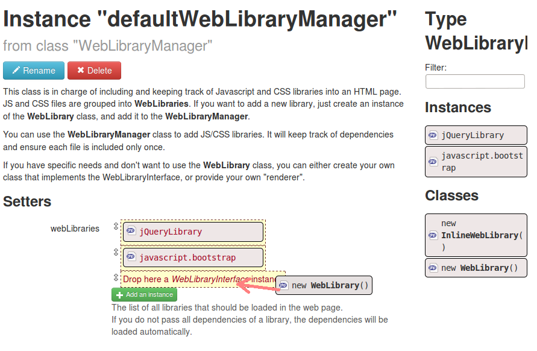
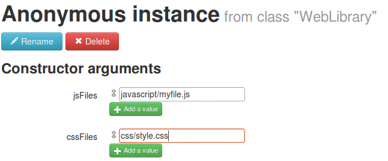

Adding JS and CSS files
=======================

There are several techniques available, depending on your need.
If you want to add JS / CSS files on every page, you will be using dependency injection to inject JS/CSS files directly in the template.
If you want to add JS / CSS files only on some pages, you will be using the code approach.

In every case, JS/CSS addition is managed by the [WebLibraryManager](http://mouf-php.com/packages/mouf/html.utils.weblibrarymanager/README.md).

The _WebLibraryManager_ is a class that references all the JS libraries and CSS files that are included in a web page.
JS files and CSS files are grouped together in _WebLibary_ objects.

On every page
-------------

The _WebLibraryManager_ comes with a default instance *defaultWebLibraryManager*, that is used by the template.



You just need to add a new *WebLibrary* to the instance list.

Then, edit this weblibrary, and add the JS and CSS files you want to include.



<div class="alert">_Note:_ Do not start the JS or CSS file path with a /. That way, the path is relative to the
ROOT_URL (the root of your web application). You can also enter a full path (http://...) if you want to
use hosted libraries, CDN, etc...</div>

On a single page
----------------

Sometimes, you only need to import JS or CSS files in one page. In this case, you will perform the addition
using PHP code. This code will typically go into your controller.

```php
\Mouf::getDefaultWebLibraryManager()->addLibrary(
	new WebLibrary(array("javascript/file1.js", "javascript/file2.js"),
			array("css/style1.css", "css/style2.css"))	
);
```

This codes create a new *WebLibrary* and adds it to the *WebLibraryManager*.
The *WebLibrary* takes an array of Javascript files as first argument, and an array
of CSS files as second argument.