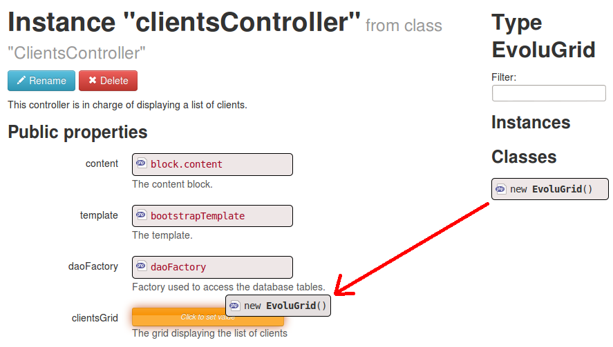
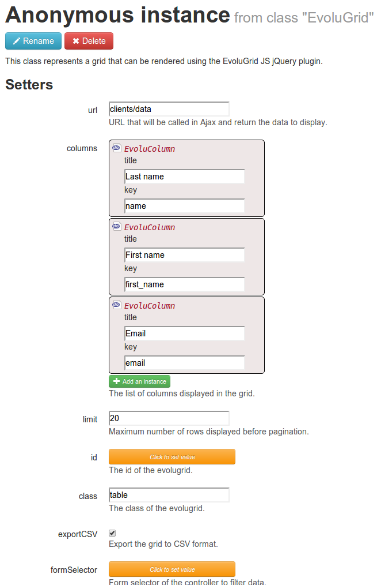

Writing a datagrid
==================

Mouf's "Getting things done" comes with [Evolugrid, a flexible Ajax table you can use to display your data](http://mouf-php.com/packages/mouf/html.widgets.evolugrid).
You can check the full [Evolugrid documentation](http://mouf-php.com/packages/mouf/html.widgets.evolugrid), or have a look at the quick tutorial below.

In this tutorial, we will assume you already know how to [write a controller](writing_a_controller.md) and how to [use TDBM daos](regenerating_daos.md).

Let's assume we have a database with a "clients" table.

<table class="table">
	<tr>
		<th>id</th>
		<th>name</th>
		<th>first_name</th>
		<th>email</th>
	</tr>
	<tr>
		<td>1</td>
		<td>Doe</td>
		<td>John</td>
		<td>john@doe.com</td>
	</tr>
	<tr>
		<td>2</td>
		<td>Durand</td>
		<td>Jim</td>
		<td>jim.durant@mymail.com</td>
	</tr>
	<tr>
		<td>...</td>
		<td>...</td>
		<td>...</td>
		<td>...</td>
	</tr>
</table>

Let's say we want to display this table in an Ajax grid, with pagination and filtering on the name and first_name columns, and a link to an "edit" form (we will not develop the edit form as part of this tutorial).

Here is the process to develop this grid

- Create a controller
- Create one action for the web page that contains the grid (with the matching view)
- Create the evolugrid in Mouf and bind it to the controller
- Create one action for the Ajax URL that will return JSON data
- Query the database and generate the JSON data

Creating the controller
-----------------------

We will go quickly through the creation of the controller. This is already covered by the [writing a controller tutorial](writing_a_controller.md).

The file structure should be this:

- src
	- Test
		- Controllers
			- ClientsController.php
	- views
		- clients_list.php

In this controller, we will add a field containing the Evolugrid, and the DaoFactory to access the database:


### Controller: ClientsController.php
```php
<?php
namespace Test\Controllers;

use Test\Dao\DaoFactory;
use Mouf\Html\Widgets\EvoluGrid\EvoluGrid;
use Mouf;
use Mouf\Html\HtmlElement\HtmlBlock;
use Mouf\Html\Template\TemplateInterface;
use Mouf\Mvc\Splash\Controllers\Controller;

/**
 * This controller is in charge of displaying a list of clients.
 */
class ClientsController extends Controller
{
	/**
	 * The content block.
	 * @var HtmlBlock
	 */
	public $content;
	
	/**
	 * The template.
	 * @var TemplateInterface
	 */
	public $template;
	
	/**
	 * Factory used to access the database tables.
	 * @var DaoFactory
	 */
	public $daoFactory;
	
	/**
	 * The grid displaying the list of clients
	 * @var EvoluGrid
	 */
	public $clientsGrid;
	
	/**
	 * Displays the list of all clients
	 * 
	 * @Get
	 * @URL clients/list
	 */
	public function index() {
		$this->template->setTitle("Clients list");
		$this->content->addFile(__DIR__."/../../views/clients_list.php", $this);
		$this->template->toHtml();
	}
}
```

### View: clients_list.php
```php
<?php /* @var $this Test\Controllers\ClientsController */ ?> 

<h1>Clients list</h1>
<?php
$this->clientsGrid->toHtml();
?>
```

Declaring controller and Evolugrid instances
--------------------------------------------

We will now declare the instances for our sample.
If you are not confortable with creating instances in Mouf, you should read the [writing a controller tutorial](writing_a_controller.md).

### The controller instance



We drag'n'drop a new Evolugrid instance in our controller instance.

### The evolugrid instance

The evolugrid instance looks like this:



You can directly define the columns in the Evolugrid by drag'n'dropping "EvoluColumn" instances

For each column, there is the "title" property that will be used in the table header, and the key, that references
the JSON dataset.

As you can see, we declare the Ajax URL that will be used to access the data, along with the maximum number of rows par page.

Generating the JSON dataset
---------------------------

In the evolugrid instance, we referred to a "clients/data" URL, but we haven't created this URL yet.
Let's add the method for this URL in the controller.

```php
	/**
	 * Returns the data for clients
	 *
	 * @Get
	 * @URL clients/data
	 */
	public function data($format = "json", $limit = null, $offset = null) {
		$clientBeans = $this->daoFactory->getClientDao()->getClients($limit, $offset);
	
		// Let's go through the beans
		foreach ($clientBeans as $clientBean) {
			/* @var $clientBean ClientBean */
			
			// Let's generate a simple array representing one row
			$row = array(
				'id' =>	$clientBean->getId(),
				'name' =>	$clientBean->getName(),
				'first_name' =>	$clientBean->getFirstName(),
				'email' =>	$clientBean->getEmail(),
			);
			
			$this->clientsGrid->addRow($row);
		}
	
		$this->clientsGrid->output($format);
	}
```

As you may have noticed, we refer to the **ClientDao::getClients** method.
This method does not exist yet, but if you are a TDBM wizard, this is actually a one line long method.

###ClientDao.php
```php
class ClientDao extends ClientDaoBase
{
	/**
	 * Returns a list of client beans.
	 * 
	 * @param int $limit
	 * @param int $offset
	 */
	public function getClients($limit, $offset) {
		// Let's call the protected method getClientListByFilter,
		// passing in parameter the offset and limit.
		return $this->getClientListByFilter(null, null, $offset, $limit);
	}
}
```


Testing
-------

That's it! We should now be able to test our grid.

<div class="alert">You might need to purge your cache (the red "Purge Cache" button in Mouf) in order to refresh the Splash URL's cache</div>

Browse to http://localhost/[appname]/clients/list and you should see this:


If you add more than 20 rows in your grid, you will see pagination that will appear automatically.

Now, this is a fairly simple grid.
You can read one of the following advanced tutorial to:

- add hyperlinks or special design
- add search forms


 